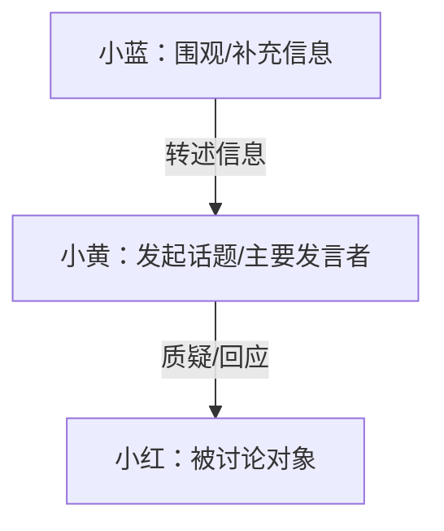
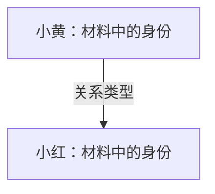
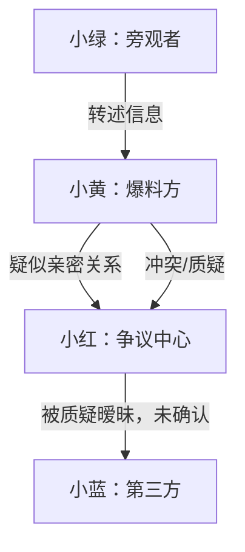

# Gossip Digest

Use this skill to turn messy chat screenshots, copied group chats, online incidents, "eating melon" materials, or abstract conversation materials into a concise, evidence-driven explanation. The goal is to clarify what happened, who is involved, and how people relate, not to decide who is morally or legally right.

## Core Rules

- Phrase conclusions as material-grounded claims: "the material states", "the chat record shows", "according to the provided screenshots", "the group chat appears to show", "currently cannot confirm".
- Do not state unverified allegations as real-world facts.
- Do not decide that a real person committed wrongdoing, cheated, scammed, lied, abused, or otherwise acted culpably unless the user provided a reliable adjudicated source and asks for a source-grounded summary.
- Do not output sensitive personal information. Redact phone numbers, ID numbers, bank cards, addresses, dorm rooms, license plates, email addresses, private account IDs, school classes, workplaces, and minors' identifying details.
- Do not write insults, personality attacks, or labels such as "scumbag", "liar", "mistress", or equivalent. Use neutral role descriptions from the material.
- Separate explicit material statements, inferred relationships, contradictory claims, and evidence gaps.
- Attach evidence locations to important people, events, relationships, and disputes whenever the source has page, line, timestamp, message, file, or chunk identifiers.
- Mention a person's gender only when the material explicitly states it, the user directly provides it, or it is necessary to understand a relationship described in the material. Do not infer gender from names, avatars, tone, occupations, or stereotypes.

## Workflow

1. Identify the input sources and preserve source labels such as file names, pages, line ranges, timestamps, speakers, or screenshot/OCR identifiers.
2. Normalize text before analysis: remove obvious repeated headers/footers, merge broken lines, keep chat speaker/time boundaries, and retain enough context for evidence references.
3. Redact private identifiers before quoting or reporting. Use forms such as `138****1234`, `[address hidden]`, `[account hidden]`, or `[school/class hidden]`.
4. Extract people and aliases:
   - Prefer memorable, neutral Chinese pseudonyms over letter labels. Use labels such as `小黄`, `小红`, `小蓝`, `小绿`, `小陈`, `小林`, `小周`, `小许` when real names or identifying details should be hidden.
   - Do not default to `A`, `B`, `C`, `Person A`, or `Person B` unless the user explicitly asks for letter labels.
   - Preserve safe, non-identifying nicknames if they are easier to remember and do not expose private identity.
   - Record gender only as `男`, `女`, `未知`, or `材料未说明`. Prefer `材料未说明` when gender is not directly supported.
   - Track aliases, account names, pronouns, and possible duplicate identities.
   - Mark uncertain alias merges as uncertain instead of silently merging them.
5. Extract events:
   - Capture time, time certainty, participants, event summary, event type, evidence location, and confidence.
   - Use `unknown time` when no reliable time is available.
6. Extract relationships:
   - Prefer relation types from this set: speaker/responder, topic initiator, questioned party, supporter, opponent, bystander, moderator/admin, relay/messenger, information source, clarification, denial, conflict, cooperation, friend, classmate/coworker, intimate/romantic, suspected intimate, ex-partner, collaborator, money transfer, family, unknown.
   - Mark whether the relation is explicit, inferred, disputed, or insufficiently supported.
7. Detect disputes and uncertainty:
   - Compare claims from different speakers or files.
   - Identify missing timestamps, one-sided statements, deleted context, indirect hearsay, and claims without direct response.
8. Render the final report in Chinese unless the user asks otherwise.
9. If the user selects an output folder or asks for files, create shareable deliverables in that folder:
   - A concise `.docx` quick-read version.
   - One or more `.png` images for fast sharing, normally a relationship graph and a one-page summary card.
   - Keep the full evidence-heavy analysis separate from the quick-share version when both are produced.

## Input Mode Router

Choose the output depth based on the user's request and the material type:

- **Quick chat mode**: Use for QQ group screenshots, copied chat logs, abstract conversation materials, or when the user asks "快速梳理", "简单介绍", "关系图", "这群人在说什么". Output only a short introduction, relationship graph, key people, and 3-5 important points unless the user asks for the full report.
- **Incident mode**: Use for online disputes, messy event threads, multi-party arguments, or materials with accusations. Include a compact timeline, disputed points, and evidence limitations.
- **Full dossier mode**: Use for long PPT/PDF/DOCX files, multi-file bundles, or when the user asks for Word/images/full analysis. Produce the complete report and optional deliverables.

For screenshot-heavy inputs, first state whether the analysis is based on OCR text, image-visible text, or copied text. If OCR quality is uncertain, include a short caveat and avoid over-reading missing messages, cropped context, emoji-only replies, or unclear avatars.

## Quick Chat Output Shape

For QQ group screenshots and other casual/abstract chat materials, prefer this shorter format:

```markdown
# 快速关系梳理

## 1. 简介

2-5 句话说明这段聊天/材料大概在讨论什么、矛盾或主题是什么、目前能确认到什么。

## 2. 人物关系图



## 3. 主要人物

| 人物 | 对应昵称/对象 | 性别 | 简介 |
|---|---|---|---|

## 4. 关键点

- 重点 1
- 重点 2
- 重点 3

## 5. 不确定处

- 截图是否缺上下文
- 是否只有单方发言
- 哪些昵称/身份无法确认
```

Only add timeline, evidence tables, and dispute analysis when they materially help the user understand the chat.

## Required Report Shape

Start with the shortest useful answer, then add structure.

```markdown
# 材料简要分析报告

## 1. 一句话概括

用 1 句话说明材料围绕哪些人、什么争议展开。不要下定论。

## 2. 材料主要内容

300 字以内，按阶段概括主线。使用“材料显示/声称/无法确认”等措辞。

## 3. 人物关系图



## 4. 主要人物表

人物介绍要简洁，优先帮助读者记住“谁是谁”。不要写成冗长履历。

| 人物 | 对应材料对象 | 性别 | 简介 | 证据位置 | 可信度 |
|---|---|---|---|---|---|

## 5. 人物关系说明

| 人物1 | 人物2 | 关系类型 | 依据 | 证据位置 | 关系确定性 |
|---|---|---|---|---|---|

## 6. 事件时间线

| 时间 | 事件 | 涉及人物 | 证据来源 | 可信度 |
|---|---|---|---|---|

## 7. 关键争议点

### 争议点一：……

- 材料支持：
- 材料反驳：
- 当前判断：

## 8. 证据不足或需要谨慎的地方

列出无法确认、来源单一、转述、时间线缺失、可能断章取义的部分。

## 9. 隐私处理说明

说明已隐藏手机号、地址、账号、学校班级、工作单位等敏感信息；如果原材料含未成年人信息，也说明已泛化处理。
```

## Quick-Share Deliverables

When the user asks for a quick reading version, shareable version, Word file, image output, or chooses an output folder, generate files in that folder in addition to the chat response.

Recommended filenames:

- `快速阅读版.docx`
- `人物关系图.png`
- `一分钟摘要卡.png`
- `完整分析报告.md` when the full report is also useful

The quick-read `.docx` should be short and forwardable:

- Title: neutral, non-accusatory, and anonymized.
- Page 1: one-sentence overview, 3-5 bullet summary, relationship graph image.
- Page 2: compact timeline and 2-4 key disputes.
- Final note: evidence boundaries and privacy handling.
- Avoid dense evidence tables unless the user asks for a detailed archive.
- If the material is ordinary chat or an abstract incident rather than gossip, use neutral titles such as `聊天快速梳理`, `事件关系梳理`, or `群聊关系图` instead of "吃瓜".

The shareable images should be readable on a phone:

- `人物关系图.png`: relationship graph only, 3-10 people, pseudonyms and short role labels.
- `一分钟摘要卡.png`: title, 3-5 key points, 3-5 timeline nodes, and a short caution line such as `仅基于现有材料整理，未确认部分已标注`.
- Use large Chinese text, high contrast, and neutral wording.
- Do not include real names, school/workplace, phone numbers, account IDs, addresses, or insulting labels.
- If gender is included, show it only when supported; otherwise omit it from the image or write `性别未说明`.

## Evidence And Confidence

Use these confidence labels consistently:

- `高`: direct source evidence exists and multiple material points are consistent, or the claim is a direct chat/document statement with clear location.
- `中`: evidence exists but depends on one side's statement, has incomplete context, or lacks independent confirmation.
- `低`: mostly hearsay, vague screenshots, unclear timestamps, indirect relay, or model inference.

Use these evidence location formats as available:

- `filename.pdf p.3`
- `chat.txt lines 23-41`
- `2025-05-12 21:30, A -> B`
- `screenshot_04 OCR`
- `source unknown`

Avoid long verbatim quotes. Quote only short phrases when needed to support a relation or dispute, and redact private information first.

## Long Or Multi-File Materials

For long materials, analyze chunks first and merge globally:

- Per chunk, collect `chunk_summary`, `persons`, `events`, `relations`, `claims`, `uncertain_points`, and `evidence_locations`.
- Merge people only when aliases are clearly connected. If not clear, write "A / alias X may be the same person, but the material does not confirm this."
- Deduplicate events by time, participants, and evidence, while preserving conflicting descriptions.
- In the final report, prioritize the main actors and major disputes. Move minor bystanders or low-confidence rumors into the uncertainty section.

## Mermaid Graph Rules

- Keep the graph readable: include the main people only, normally 3-10 nodes.
- Use memorable pseudonyms such as `小黄`, `小红`, `小蓝`, `小绿`; avoid bare letter labels unless requested.
- Use safe labels and material roles, not private identifiers.
- Put the relation type on every edge.
- Use ordinary Mermaid syntax that renders in Markdown.
- If relationship certainty is low, include `疑似` or `未确认` in the edge label instead of using accusatory wording.

Example:


